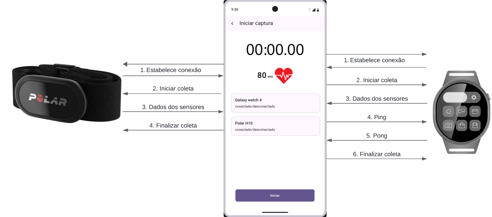
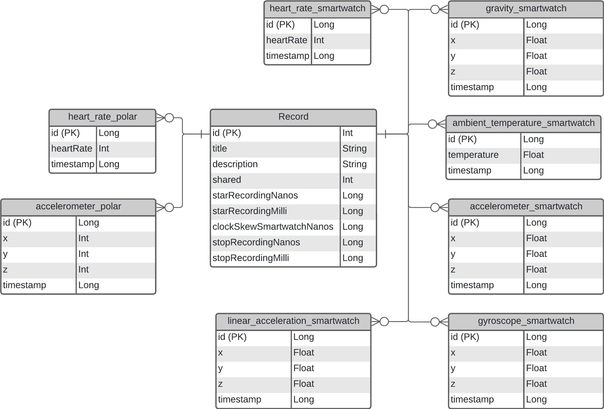

# 📊 Colepp — Cross-Platform Tool for Wearable Device Data Collection

[:brazil: version](README-PT-BR.md)
## 🧩 Description

**Colepp** is an **open-source** tool for collecting and synchronizing physiological and movement data from wearable devices such as smartwatches and heart rate monitor straps.  

The system consists of **two main modules**:
- **Mobile (Android)** — centralizes data control and storage, manages connections, and exports collected data.
- **Wear (Wear OS)** — runs on the smartwatch, collects onboard sensor data, and sends it to the mobile app.

The focus is to enable **structured and synchronized data collection**, making it easier to create datasets for research in health monitoring, human activity recognition (HAR), and heart rate estimation algorithm development.

---

## 🗂️ Table of Contents

- [📊 Colepp — Cross-Platform Tool for Wearable Device Data Collection](#-colepp--cross-platform-tool-for-wearable-device-data-collection)
  - [🧩 Description](#-description)
  - [📱 Features](#-features)
    - [Mobile Module (Android)](#mobile-module-android)
    - [Wear Module (Wear OS)](#wear-module-wear-os)
  - [⚙️ Installation and Execution](#️-installation-and-execution)
  - [📱 User Guide](#-user-guide)
    - [Start a new capture](#start-a-new-capture)
    - [Connect devices](#connect-devices)
    - [Delete a capture](#delete-a-capture)
    - [Edit a capture](#edit-a-capture)
    - [Download a capture in CSV format](#download-a-capture-in-csv-format)
    - [Share a capture in CSV format](#share-a-capture-in-csv-format)
  - [📡 Device Communication](#-device-communication)
  - [🗄️ Database](#️-database)
  - [⚠️ Limitations](#️-limitations)
  - [📈 Sensor Sampling Rate](#-sensor-sampling-rate)
  - [🤝 Contributing](#-contributing)
  - [📄 License](#-license)

---

## 📱 Features

### Mobile Module (Android)
- **Device connection**: pairing with Polar H10 strap (via BLE) and Wear OS smartwatch.
- **Simultaneous data collection**:
  - Polar H10: Accelerometer and heart rate via ECG.
  - Wear OS: Accelerometer, gyroscope, and heart rate via PPG.
- **Precise time synchronization** between data from both devices, with time offset protocol using the `MessageClient` API.
- **Local storage** in SQLite database.
- **On-demand CSV export**.
- **Intuitive interface**:
  - Home screen for new or past collections.
  - Usage instructions.
  - Session details with metadata and HR graph.
  - Real-time collection with connection status and updated data.

### Wear Module (Wear OS)
- **Standby screen**: indicates readiness and connection status.
- **Active collection screen**: displays estimated HR via PPG and visual collection indicator.
- **Continuous data transmission** to the mobile app.
- **Compatibility**: Wear OS 3 or higher.

---

## ⚙️ Installation and Execution

1. **Clone the repository**:  
   ```bash
   git clone https://github.com/life-ufes/Wearable-Health-Data-Sync.git
   ```

2. **Open in Android Studio**:  
   - Go to `File > Open` and select the project folder.

3. **Set up devices**:  
   - Follow the official guide to pair smartwatch and smartphone: https://developer.android.com/studio/run/device

4. **Run modules**:  
   - Select the mobile configuration and run it on the smartphone.  
   - Select the wear configuration and run it on the smartwatch.

---

## 📱 User Guide

#### Start a new capture

1. On the **Home** screen, click **<code> New capture</code>** in the bottom navigation menu.
2. You will be redirected to the **New capture** screen:
   - Enter a **name** with more than 3 characters (description is optional).
3. Click **Create** to go to the **Start capture** screen [(connection guide)](#connect-devices).
4. Make sure **both devices are connected**.
5. Click **Start**:
   - A 3-second countdown will appear before the capture starts.
6. The capture will be saved **locally** until you:
   - Click **Finish**  
   **or**
   - A device gets disconnected.
7. To finish, click **Back** and you will return to the **Home** screen, where you can see the list of all saved captures.

#### Connect devices

1. For the app to automatically detect and connect to the Polar H10 and the smartwatch, the devices must already be paired with your phone/tablet.
2. With Bluetooth turned on and the devices paired, simply click on each card to start automatic connection.
3. Wait a few seconds for them to connect; you will receive feedback when the connection is successful, and the button will be enabled.
4. For the smartwatch, when you click the card, the app will automatically launch on the device. If that does not happen, or if you prefer, you can manually open it by tapping the app icon directly on the smartwatch.

#### Delete a capture

1. On the **Home** screen, click the  icon on the capture card you want to delete.
2. A confirmation dialog will appear, as **data cannot be recovered** after deletion.
3. To confirm, click **Delete**.
4. To cancel, click **Cancel**.

#### Edit a capture

1. On the **Home** screen, click the  icon on the capture card you want to edit.
2. You will be redirected to the **Edit capture** screen, where you can change the name and description.
3. To save changes, click **Save**.
4. To discard changes, click **Back** in the upper-left corner or use the navigation bar.

#### Download a capture in CSV format

1. Click the **card** of the desired capture.
2. On the **capture details** screen, click the  icon in the top-right corner.
3. Wait for the **loading** dialog while the file is being generated.
4. If successful:
   - A **success** message will appear with the location where the file was saved (usually in the device's default *Downloads* folder).
5. If there is an error:
   - An error message will be displayed.

#### Share a capture in CSV format

1. Click the **card** of the desired capture.
2. On the **capture details** screen, click the  icon in the top-right corner.
3. Wait for the **loading** dialog while the file is being generated.
4. If successful:
   - A **Sharing Menu** will appear listing the apps available for sending the file.
5. If there is an error:
   - An error message will be displayed.

---

## 📡 Device Communication

Communication between the mobile app and the wearable uses the Google Play Services MessageClient API, which allows real-time message exchange between devices connected via Bluetooth. The image below illustrates the data flow and interaction between system components:


---

## 🗄️ Database

The application uses SQLite to locally store collected data. The diagram below shows the database structure, including the main tables and their relationships:


---

## 📈 Sensor Sampling Rate
| Sensor | Sampling Rate |
|----------------------|--------------------------|
| Accelerometer (Wear OS) | 25 Hz |
| Gyroscope (Wear OS) | 50 Hz |
| Heart Rate (Wear OS) | 1 Hz |
| Gravity (Wear OS) | 25 Hz |
| Linear Acceleration (Wear OS) | 25 Hz |
| Accelerometer (Polar H10) | 25 Hz |
| Heart Rate (Polar H10) | 1 Hz |

---

## ⚠️ Limitations

App version limitations:
- The smartwatch app is only compatible with Wear OS 3.0 or higher.
- The smartphone app requires Android 11.0 (R) or higher.

---

## 🤝 Contributing
Contributions are welcome!  
To contribute:

1. **Fork** the repository.

2. Create a **branch** with your feature/fix:  
   ```bash
   git checkout -b my-feature
   ```

3. **Commit** your changes:  
   ```bash
   git commit -m "Add new feature X"
   ```

4. **Push** to your branch:  
   ```bash
   git push origin my-feature
   ```

5. Open a **Pull Request**.

---

## 📄 License
This project is licensed under the MIT License — see the [LICENSE](LICENSE) file for details.